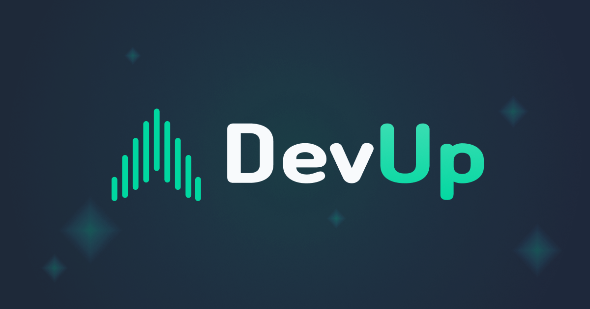

# Devup

  

  
뎁업

 

## 🧑‍🏫 프로젝트 소개

**Devup**은 개발자와 IT 직군 종사자, 취업 준비생이
스터디, 챌린지, 사이드 프로젝트, 공모전 등
다양한 모임을 통해 함께 배우고 만들며 성장할 수 있도록 돕는 모임 중심 플랫폼입니다.

<a href="public/readme/4팀_ppt.pdf"  target="_blank" ><b>피피티</b></a>

---

## ⚔️ 기술 스택

### **Frontend**

|                                                                                                          | 사용 기술  | 역할                  |
| :------------------------------------------------------------------------------------------------------- | :--------- | :-------------------- |
|           | Next.js    | React 기반 프레임워크 |
|                 | React      | UI 라이브러리         |
|  | TypeScript | 정적 타입 기반 개발   |

### **UI / Styling**

|                                                                                                               | 사용 기술    | 역할                           |
| :------------------------------------------------------------------------------------------------------------ | :----------- | :----------------------------- |
|  | Tailwind CSS | 유틸리티 퍼스트 CSS 프레임워크 |
|             | Radix UI     | 접근성 높은 UI 컴포넌트        |

### **State / Data**

|                                                                                                                  | 사용 기술      | 역할                          |
| :--------------------------------------------------------------------------------------------------------------- | :------------- | :---------------------------- |
|                     | Zustand        | 클라이언트 상태 관리          |
|  | TanStack Query | 서버 상태 관리 및 데이터 패칭 |

### **Form / Validation**

|                                                                                                                       | 사용 기술       | 역할                      |
| :-------------------------------------------------------------------------------------------------------------------- | :-------------- | :------------------------ |
|  | React Hook Form | 폼 상태 관리 및 입력 처리 |
|                                    | Zod             | 스키마 기반 유효성 검증   |

### **Editor / UX**

|                                                                                                   | 사용 기술 | 역할             |
| :------------------------------------------------------------------------------------------------ | :-------- | :--------------- |
|  | Tiptap    | 에디터 기능 구현 |
|        | Sonner    | 토스트 알림 UI   |

### **Development Tools**

|                                                                                                       | 사용 기술 | 역할                                  |
| :---------------------------------------------------------------------------------------------------- | :-------- | :------------------------------------ |
|  | Storybook | UI 컴포넌트 문서화 및 독립 개발       |
|  | Chromatic | Storybook 기반 UI 배포 및 시각적 검토 |
|           | ESLint    | 코드 린팅 및 품질 관리                |
|     | Prettier  | 코드 포맷팅                           |
|                | Husky     | Git Hook 기반 코드 검증 자동화        |
